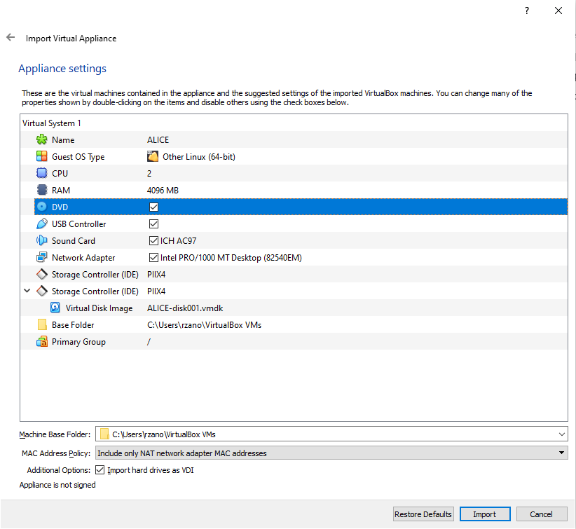
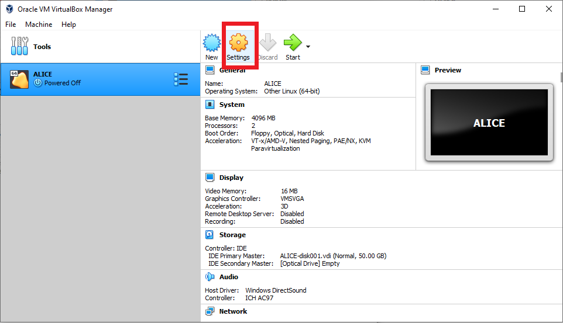
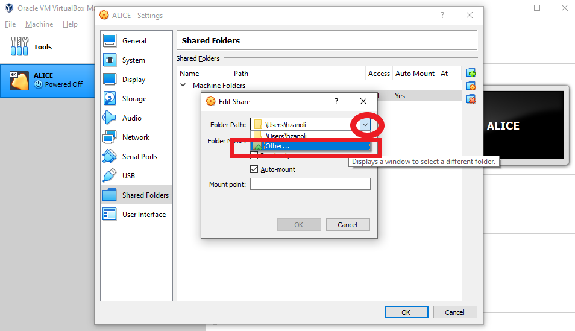

.. _import_vm:

Importing the virtual machine
=============================

First, you need to download the image file. The VM images are available
in the SURFdrive, click on `this
link <https://surfdrive.surf.nl/files/index.php/s/yWG0XgtqZPMs1jD>`__ to
download.

Open the app you just installed, **Oracle VM VirtualBox**, and click in
**Import**

.. figure:: img/import.png
   :width: 80%
   :align: center

It will open a new windows called **Import Virtual Assistance**. Click
on the Icon on the right to **Find a File**. Select the file with the VM
(*ALICE.ova* or the name of the file that you downloaded)
and select click in **Open** to confirm. Then you are back
to the previous screen and you can click on **Next**.

.. figure:: img/find_file.png
   :width: 80%
   :align: center

This will load the **Appliance settings** screen, as seen bellow. This
gives the details of the Virtual Machine. The current values are a
suggestion that should work for most people. If you have 8 GB of RAM and
a dual core processor (or more), you can leave as it is. If you are not
sure, you can check it on
`Windows <https://support.microsoft.com/en-us/help/13443/windows-which-version-am-i-running>`__,
`Mac <https://support.apple.com/guide/system-information/get-system-information-syspr35536/mac>`__
or
`Ubuntu <https://askubuntu.com/questions/55609/how-do-i-check-system-specifications>`__.

.. warning::
    If you have less than 8 GB of RAM, please consider to change the RAM value to a
    lower value, such as 2048 MB or 3072 MB.

Now click in **Import**.

This will import the Virtual Machine. It might take a while, be patient.
Once finished, you should see that the Virtual Machine will be imported,
as shown bellow.

.. figure:: img/imported_machine.png
   :alt: 

Now let's configure your shared folder. The shared folder will let and
edit you see a particular of your computer in the Virtual Machine.

.. caution::
    For security reasons, do not share all your drive, but only a subset of it,
    such as your personal folder. It is even better to share only a small subset of your personal folders.

To configure it, click in **Settings**.

In the new screen, click on Shared Folders.

.. figure:: img/shared_folder_settings.png
   :width: 80%
   :align: center

In this window, Click on the user name (probably **hzanoli**) and then in **Edit share** (the
second item on the right), as shown in the figure bellow.

.. figure:: img/edit_shared_settings.png
   :width: 80%
   :align: center

Now add, change the folder that will be shared. First click on the arrow
on the left and in the drop down menu, select **Other**.

In this new menu, select your user folder (or other folder you would
prefer to share between your machine and the VM) and click on **Select
Folder**.

.. figure:: img/select_folder.png
   :width: 80%
   :align: center

Now, check that **Auto-mount** is selected. If not, select it. In
**Folder Name**, you can add the name you would like. For example, you
can leave the automatic name generated by the program (which will be
your username) or to call it *alice*. Then click **OK** and **Ok**
again.

.. figure:: img/automatic_mount.png
   :width: 80%
   :align: center

Now your machine should be fully configured for our needs. You can now
go to the next step, :ref:`running the machine file<run_vm>`.
