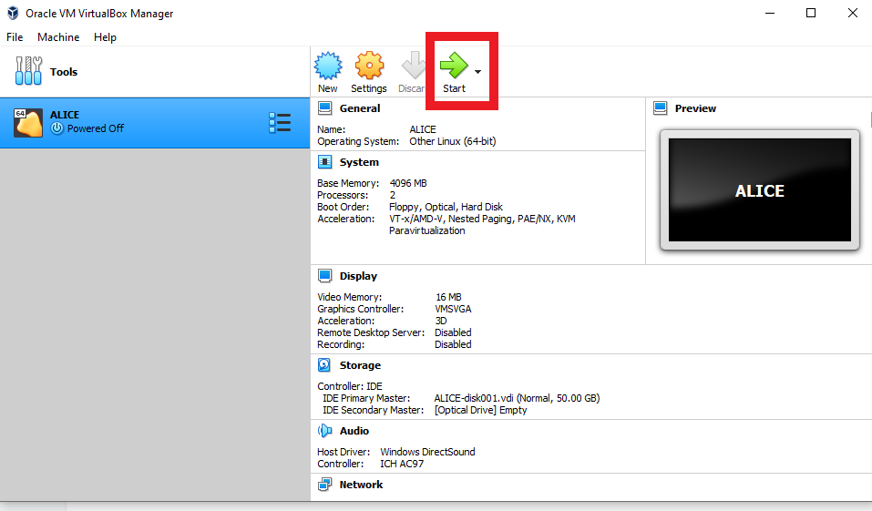

.. _run_vm:

Running the virtual machine
===========================

Now, on **Oracle VM VirtualBox** main screen, you can click on the VM you just imported, **ALICE**, and click on **Start.**

   

Wait, the machine will automatically login and open the Desktop. If not, you will need to type the password: 
``quarkgluon``. You will  also need this password in case you would like to install additional software.
Now you can use it! 

To open the a program, for example the Terminal, you can click on **Activities** on the top left and type in 
the search box. 

To open the Alice environment, just type **ali** in the terminal.

The machine includes Emacs and sublime text to edit text, but you can in principle add anything you would like.

